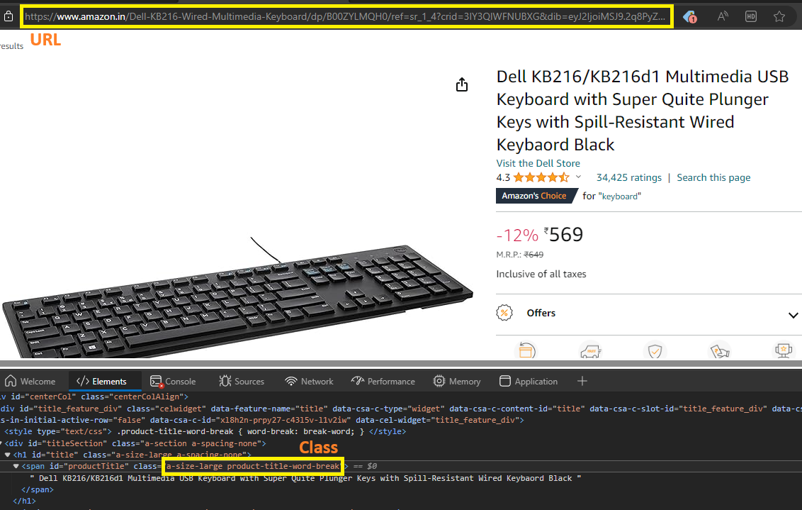
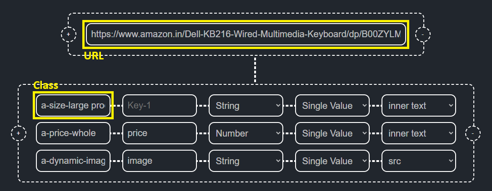
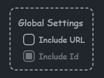
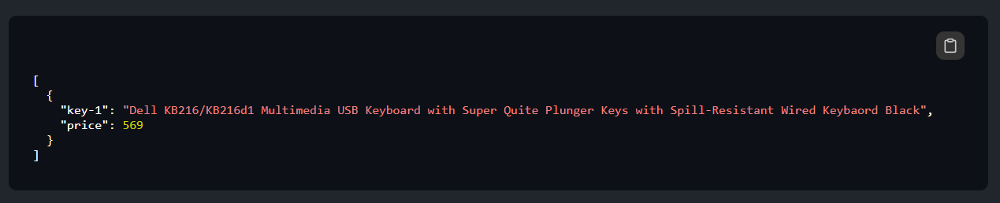
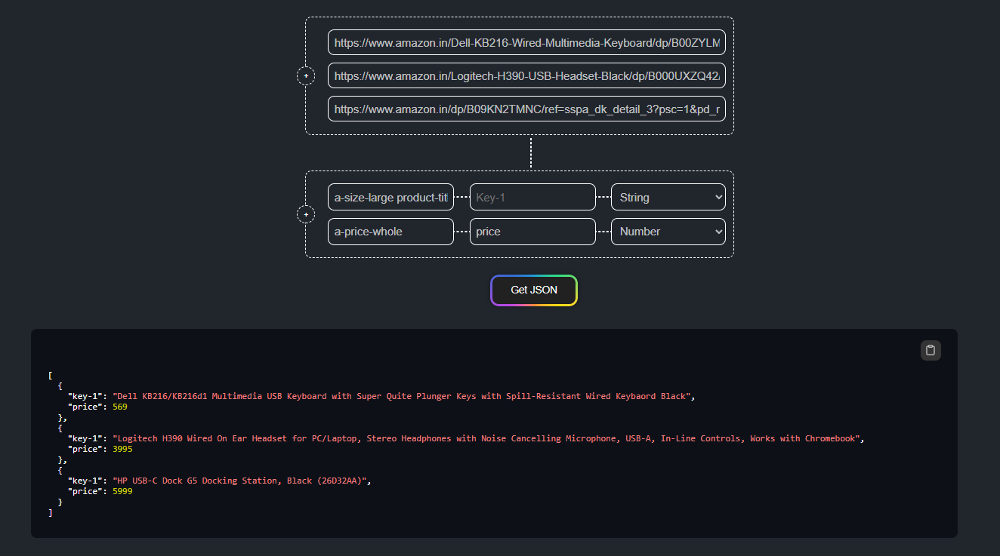
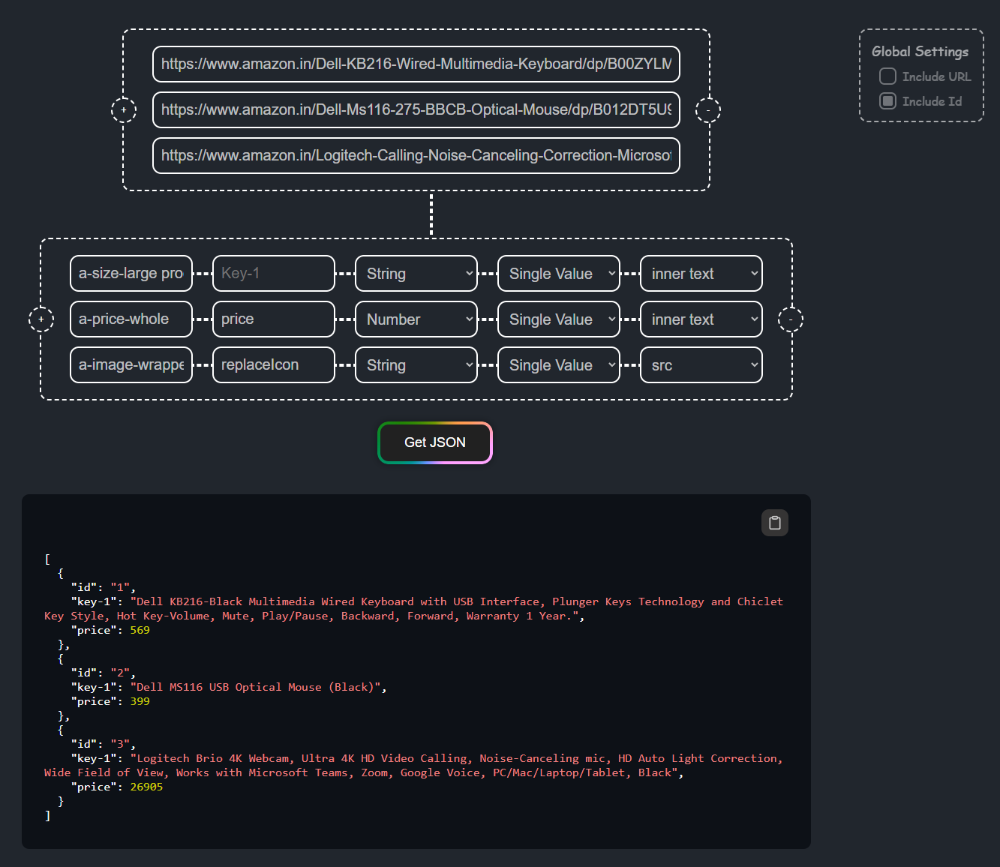

## How I got the idea ?

I was building [AMAZON CLONE](https://amazon-clone-by-charan.vercel.app/). I had no source to collect JSON data for categorties, product details, etc. Collecting(copying) the data from [AMAZON](https://amazon.in), and wrting it in JSON format for every product was a tedious task of the project.

## What is this Application ?

"Get JSON" is a simple web-scraping tool which provides JSON data from web-pages, required for your project. Thereby saving tons of copy-pasting time.

## How does it work ? (Steps)

**Step-1:** The URLs from which the similar(same props) data to be fetched are specified in URLs Section.

**Step-2:** The Classes(whole string) of required data's HTML element are specified in classes section, with optional key-names, data-type and search-type.

- **Key-name** : Unique name given to a value in an object.
- **Data-type [String, Number, Boolean]** : Data-type of a value.
- **Search-type [Single Value, Multiple Values]**: Search Until a value is found (or) Search whole page and find all values.
- **Value-Type [inner text, href, src, custom]**: Type of value to be extracted from selected HTML element (Attribute/Inner-Text).

**Step-3:(Optional)** Adjust the Global Settings. (Whether to include the fields in JSON on not)

**Step-4:** Hit the "Get JSON" Button.

**Step-5:** ...few moments later... Shazam⚡!!. You have your JSON data from a webpage.

(And ofcourse the same keys can be fetched for mutiple URLs)

Watch the [DEMO VIDEO](https://www.youtube.com/watch?v=XYSKLEEvNYc&list=PLgSNzrXIGnTo3etHGDj1KN23acOJbBf4T&index=3) if still not clear.

## Who can use this ?

Any developer who are building a Clone Application (or) who has requirement of JSON data from webpages for personal projects.

## Links

- [LIVE](https://getjson.vercel.app/)
- [BACKEND Repo](https://github.com/Charan-Mudiraj/Get-JSON---Backend)
- [Version 1](https://www.youtube.com/watch?v=SW8XS0zJ22U&list=PLgSNzrXIGnTo3etHGDj1KN23acOJbBf4T&index=1)
- [Version 2 (Added Search-Type Feature)](https://www.youtube.com/watch?v=36JRiw6xad0&list=PLgSNzrXIGnTo3etHGDj1KN23acOJbBf4T&index=2)
- [Version 3 (Added Value-Type Feature)](https://www.youtube.com/watch?v=XYSKLEEvNYc&list=PLgSNzrXIGnTo3etHGDj1KN23acOJbBf4T&index=3)
